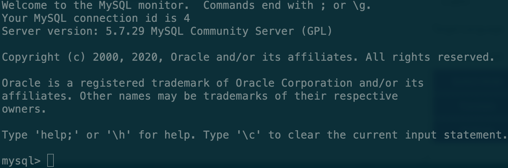

# 登陆MySQL数据库

刚才我们通过docker的方式创建了数据库，接下来我们就登陆到MySQL数据库中看一下

```text
mysql -u root -p
```

之后会提示你输入密码，就是你在安装mysql时设置的密码，如果没有设置过密码的话可以直接回车。然后你就可以看到mysql的欢迎界面了




使用docker方式安装的同学，也可以使用，用户名：user，密码password登陆。



