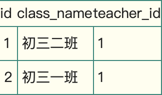
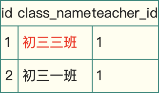

# 并发控制

**关于事务相关内容请查看：**[**事务**](../../shu-ju-cao-zuo/shi-wu/)\*\*\*\*

我们都知道事务的几种性质，数据库为了维护这些性质，尤其是一致性和隔离性，一般使用加锁这种方式。同时数据库又是个高并发的应用，同一时间会有大量的并发访问，如果加锁过度，会极大的降低并发处理能力。所以对于加锁的处理，可以说就是数据库对于事务处理的精髓所在。这里通过分析MySQL中InnoDB引擎的加锁机制，来抛砖引玉，让读者更好的理解，在事务处理中数据库到底做了什么。

## 一次封锁or两段锁

因为有大量的并发访问，为了预防死锁，一般应用中推荐使用一次封锁法，就是在方法的开始阶段，已经预先知道会用到哪些数据，然后全部锁住，在方法运行之后，再全部解锁。这种方式可以有效的避免循环死锁，但在数据库中却不适用，因为在事务开始阶段，数据库并不知道会用到哪些数据。

数据库遵循的是两段锁协议，将事务分成两个阶段，加锁阶段和解锁阶段（所以叫两段锁）

* 加锁阶段：在该阶段可以进行加锁操作。在对任何数据进行读操作之前要申请并获得S锁（共享锁，其它事务可以继续加共享锁，但不能加排它锁），在进行写操作之前要申请并获得X锁（排它锁，其它事务不能再获得任何锁）。加锁不成功，则事务进入等待状态，直到加锁成功才继续执行。
* 解锁阶段：当事务释放了一个封锁以后，事务进入解锁阶段，在该阶段只能进行解锁操作不能再进行加锁操作。

这种方式虽然无法避免死锁，但是两段锁协议可以保证事务的并发调度是串行化（串行化很重要，尤其是在数据恢复和备份的时候）的。

## MySQL锁的种类

MySQL中锁的种类很多，有常见的表锁和行锁，也有新加入的Metadata Lock等等,表锁是对一整张表加锁，虽然可分为读锁和写锁，但毕竟是锁住整张表，会导致并发能力下降，一般是做ddl处理时使用。

* 表级锁：开销小，加锁快。发生锁冲突概率高，并发性低。由于锁定资源的颗粒度很小，所以每次获取锁和释放锁需要做的事情也更多，带来的消耗自然也就更大了。此外，行级锁定也最容易发生死锁。
* 行级锁：开销大，加锁满。发生锁冲突概率低，并发性高。锁定颗粒度大所带来最大的负面影响就是出现锁定资源争用的概率也会最高，致使并发度大打折扣。

行锁则是锁住数据行，这种加锁方法比较复杂，但是由于只锁住有限的数据，对于其它数据不加限制，所以并发能力强，MySQL一般都是用行锁来处理并发事务。这里主要讨论的也就是行锁。InnoDB默认的是行级锁。

### Read Committed

在RC级别中，数据的读取都是不加锁的，但是数据的写入、修改和删除是需要加锁的。效果如下

```text
MySQL> show create table class_teacher \G\
Table: class_teacher
Create Table: CREATE TABLE `class_teacher` (
  `id` int(11) NOT NULL AUTO_INCREMENT,
  `class_name` varchar(100) COLLATE utf8mb4_unicode_ci NOT NULL,
  `teacher_id` int(11) NOT NULL,
  PRIMARY KEY (`id`),
  KEY `idx_teacher_id` (`teacher_id`)
) ENGINE=InnoDB AUTO_INCREMENT=5 DEFAULT CHARSET=utf8mb4 COLLATE=utf8mb4_unicode_ci
1 row in set (0.02 sec)
MySQL> select * from class_teacher;
+----+--------------+------------+
| id | class_name   | teacher_id |
+----+--------------+------------+
|  1 | 初三一班     |          1 |
|  3 | 初二一班     |          2 |
|  4 | 初二二班     |          2 |
+----+--------------+------------+
```

由于MySQL的InnoDB默认是使用的RR级别，所以我们先要将该session开启成RC级别，并且设置binlog的模式

```text
SET session transaction isolation level read committed;
SET SESSION binlog_format = 'ROW';（或者是MIXED）
```

| 事务 | 事务 |
| :--- | :--- |
| begin | begin |
| update class\_teacher set class\_name=‘初三二班’ where teacher\_id=1; | update class\_teacher set class\_name=‘初三三班’ where teacher\_id=1; |
| commit; |  |

为了防止并发过程中的修改冲突，事务A中MySQL给teacher\_id=1的数据行加锁，并一直不commit（释放锁），那么事务B也就一直拿不到该行锁，wait直到超时。

这时我们要注意到，teacher\_id是有索引的，如果是没有索引的class\_name呢？update class\_teacher set teacher\_id=3 where class\_name = ‘初三一班’; 那么MySQL会给整张表的所有数据行的加行锁。这里听起来有点不可思议，但是当sql运行的过程中，MySQL并不知道哪些数据行是 class\_name = ‘初三一班’的（没有索引嘛），如果一个条件无法通过索引快速过滤，存储引擎层面就会将所有记录加锁后返回，再由MySQL Server层进行过滤。

但在实际使用过程当中，MySQL做了一些改进，在MySQL Server过滤条件，发现不满足后，会调用unlock\_row方法，把不满足条件的记录释放锁 \(违背了二段锁协议的约束\)。这样做，保证了最后只会持有满足条件记录上的锁，但是每条记录的加锁操作还是不能省略的。可见即使是MySQL，为了效率也是会违反规范的。（参见《高性能MySQL》中文第三版p181）

这种情况同样适用于MySQL的默认隔离级别RR。所以对一个数据量很大的表做批量修改的时候，如果无法使用相应的索引，MySQL Server过滤数据的的时候特别慢，就会出现虽然没有修改某些行的数据，但是它们还是被锁住了的现象。

### Repeatable Read

这是MySQL中InnoDB默认的隔离级别。我们姑且分“读”和“写”两个模块来讲解。

#### 读

读就是可重读，可重读这个概念是一事务的多个实例在并发读取数据时，会看到同样的数据行，有点抽象，我们来看一下效果。

<table>
  <thead>
    <tr>
      <th style="text-align:left">&#x4E8B;&#x52A1;A</th>
      <th style="text-align:left">&#x4E8B;&#x52A1;B</th>
    </tr>
  </thead>
  <tbody>
    <tr>
      <td style="text-align:left">begin&#xFF1B;</td>
      <td style="text-align:left">begin&#xFF1B;</td>
    </tr>
    <tr>
      <td style="text-align:left">
        <p>select id,class_name,teacher_id from class_teacher where teacher_id=1;</p>
        <p>
          
        </p>
      </td>
      <td style="text-align:left"></td>
    </tr>
    <tr>
      <td style="text-align:left"></td>
      <td style="text-align:left">update class_teacher set class_name=&apos;&#x521D;&#x4E09;&#x4E09;&#x73ED;&apos;
        where id=1;</td>
    </tr>
    <tr>
      <td style="text-align:left"></td>
      <td style="text-align:left">commit;</td>
    </tr>
    <tr>
      <td style="text-align:left">
        <p>select id,class_name,teacher_id from class_teacher where teacher_id=1;</p>
        <p>
          
        </p>
        <p>&#x8BFB;&#x5230;&#x4E86;&#x4E8B;&#x52A1;B&#x4FEE;&#x6539;&#x7684;&#x6570;&#x636E;&#xFF0C;&#x548C;&#x7B2C;&#x4E00;&#x6B21;&#x67E5;&#x8BE2;&#x7684;&#x7ED3;&#x679C;&#x4E0D;&#x4E00;&#x6837;&#xFF0C;&#x662F;&#x4E0D;&#x53EF;&#x91CD;&#x8BFB;&#x7684;&#x3002;</p>
      </td>
      <td style="text-align:left"></td>
    </tr>
    <tr>
      <td style="text-align:left">commit;</td>
      <td style="text-align:left"></td>
    </tr>
  </tbody>
</table>事务B修改id=1的数据提交之后，事务A同样的查询，后一次和前一次的结果不一样，这就是**不可重读**（重新读取产生的结果不一样）。这就很可能带来一些问题，那么我们来看看在RR级别中MySQL的表现：

<table>
  <thead>
    <tr>
      <th style="text-align:left">&#x4E8B;&#x52A1;A</th>
      <th style="text-align:left">&#x4E8B;&#x52A1;B</th>
      <th style="text-align:left">&#x4E8B;&#x52A1;C</th>
    </tr>
  </thead>
  <tbody>
    <tr>
      <td style="text-align:left">begin;</td>
      <td style="text-align:left">begin;</td>
      <td style="text-align:left">begin;</td>
    </tr>
    <tr>
      <td style="text-align:left">
        <p>select id,class_name,teacher_id from class_teacher where teacher_id=1;</p>
        <p>
          
        </p>
      </td>
      <td style="text-align:left"></td>
      <td style="text-align:left"></td>
    </tr>
    <tr>
      <td style="text-align:left"></td>
      <td style="text-align:left">
        <p>update class_teacher set class_name=&apos;&#x521D;&#x4E09;&#x4E09;&#x73ED;&apos;
          where id=1;</p>
        <p>commit;</p>
      </td>
      <td style="text-align:left"></td>
    </tr>
    <tr>
      <td style="text-align:left"></td>
      <td style="text-align:left"></td>
      <td style="text-align:left">
        <p>insert into class_teacher values (null,&apos;&#x521D;&#x4E09;&#x4E09;&#x73ED;&apos;,1);</p>
        <p>commit;</p>
      </td>
    </tr>
    <tr>
      <td style="text-align:left">
        <p>select id,class_name,teacher_id from class_teacher where teacher_id=1;</p>
        <p>
          
        </p>
        <p>&#x6CA1;&#x6709;&#x8BFB;&#x5230;&#x4E8B;&#x52A1;B&#x4FEE;&#x6539;&#x7684;&#x6570;&#x636E;&#xFF0C;&#x548C;&#x7B2C;&#x4E00;&#x6B21;sql&#x8BFB;&#x53D6;&#x7684;&#x4E00;&#x6837;&#xFF0C;&#x662F;&#x53EF;&#x91CD;&#x590D;&#x8BFB;&#x7684;&#x3002;</p>
        <p>&#x6CA1;&#x6709;&#x8BFB;&#x5230;&#x4E8B;&#x52A1;C&#x65B0;&#x6DFB;&#x52A0;&#x7684;&#x6570;&#x636E;&#x3002;</p>
      </td>
      <td style="text-align:left"></td>
      <td style="text-align:left"></td>
    </tr>
    <tr>
      <td style="text-align:left">commit;</td>
      <td style="text-align:left"></td>
      <td style="text-align:left"></td>
    </tr>
  </tbody>
</table>我们注意到，当teacher\_id=1时，事务A先做了一次读取，事务B中间修改了id=1的数据，并commit之后，事务A第二次读到的数据和第一次完全相同。所以说它是可重读的。那么MySQL是怎么做到的呢？

内容请见：[MVCC](mvcc.md#mvcc-zai-mysql-de-innodb-zhong-de-shi-xian)

### Serializable

这个级别很简单，读加共享锁，写加排他锁，读写互斥。使用的悲观锁的理论，实现简单，数据更加安全，但是并发能力非常差。如果你的业务并发的特别少或者没有并发，同时又要求数据及时可靠的话，可以使用这种模式。

## 不可重复读和幻读的区别

更多内容请看：[事务隔离级别](../../shu-ju-cao-zuo/shi-wu/shi-wu-ge-li-ji-bie.md)

很多人容易搞混不可重复读和幻读，确实这两者有些相似。但不可重复读重点在于update和delete，而幻读的重点在于insert。

如果使用锁机制来实现这两种隔离级别，在可重复读中，该sql第一次读取到数据后，就将这些数据加锁，其它事务无法修改这些数据，就可以实现可重复读了。但这种方法却无法锁住insert的数据，所以当事务A先前读取了数据，或者修改了全部数据，事务B还是可以insert数据提交，这时事务A就会发现莫名其妙多了一条之前没有的数据，这就是幻读，不能通过行锁来避免。需要Serializable隔离级别 ，读用读锁，写用写锁，读锁和写锁互斥，这么做可以有效的避免幻读、不可重复读、脏读等问题，但会极大的降低数据库的并发能力。

所以说不可重复读和幻读最大的区别，就在于如何通过锁机制来解决他们产生的问题。

上文说的，是使用[悲观锁](bei-guan-suo-yu-le-guan-suo.md#bei-guan-suo)机制来处理这两种问题，但是MySQL、ORACLE、PostgreSQL等成熟的数据库，出于性能考虑，都是使用了以[乐观锁](bei-guan-suo-yu-le-guan-suo.md#le-guan-suo)为理论基础的[MVCC](mvcc.md)（多版本并发控制）来避免这两种问题。

