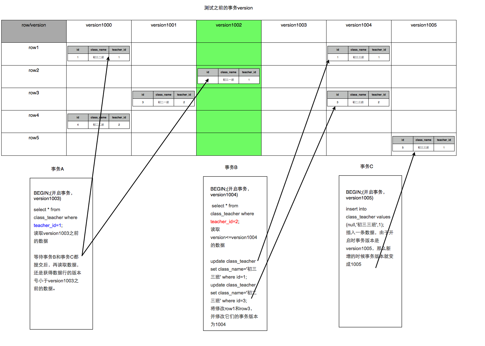

# MVCC

> MVCC，Multi-Version Concurrency Control，多版本并发控制。MVCC 是一种并发控制的方法，一般在数据库管理系统中，实现对数据库的并发访问；在编程语言中实现事务内存。

如果有人从数据库中读数据的同时，有另外的人写入数据，有可能读数据的人会看到『半写』或者不一致的数据。有很多种方法来解决这个问题，叫做并发控制方法。最简单的方法，通过加锁，让所有的读者等待写者工作完成，但是这样效率会很差。MVCC 使用了一种不同的手段，每个连接到数据库的读者，**在某个瞬间看到的是数据库的一个快照**，写者写操作造成的变化在写操作完成之前（或者数据库事务提交之前）对于其他的读者来说是不可见的。

当一个 MVCC 数据库需要更一个一条数据记录的时候，它不会直接用新数据覆盖旧数据，而是将旧数据标记为过时（obsolete）并在别处增加新版本的数据。这样就会有存储多个版本的数据，但是只有一个是最新的。这种方式允许读者读取在他读之前已经存在的数据，即使这些在读的过程中半路被别人修改、删除了，也对先前正在读的用户没有影响。\*\*这种多版本的方式避免了填充删除操作在内存和磁盘存储结构造成的空洞的开销，但是需要系统周期性整理（sweep through）以真实删除老的、过时的数据。\*\*对于面向文档的数据库（Document-oriented database，也即半结构化数据库）来说，这种方式允许系统将整个文档写到磁盘的一块连续区域上，当需要更新的时候，直接重写一个版本，而不是对文档的某些比特位、分片切除，或者维护一个链式的、非连续的数据库结构。

MVCC 提供了时点（point in time）一致性视图。MVCC 并发控制下的读事务一般使用**时间戳或者事务 ID**去标记当前读的数据库的状态（版本），读取这个版本的数据。读、写事务相互隔离，不需要加锁。**读写并存的时候，写操作会根据目前数据库的状态，创建一个新版本，并发的读则依旧访问旧版本的数据。**

**总的来说**

> MVCC就是同一份数据临时保留多版本的一种方式，进而实现并发控制

**那**么此处需要注意的点就是：

* 在读写并发的过程中如何实现多版本？
* 在读写并发之后，如何实现旧版本的删除（毕竟很多时候只需要一份最新版的数据就够了）？

要说明的是，MVCC的实现没有固定的规范，每个数据库都会有不同的实现方式，这里讨论的是InnoDB的MVCC。

## MVCC在MySQL的InnoDB中的实现

在InnoDB中，会在每行数据后添加两个额外的隐藏的值来实现MVCC，这两个值一个记录这行数据何时被创建，另外一个记录这行数据何时过期（或者被删除）。 在实际操作中，存储的并不是时间，而是事务的版本号，每开启一个新事务，事务的版本号就会递增。 在可重读Repeatable reads事务隔离级别下：

* SELECT时，读取创建版本号&lt;=当前事务版本号，删除版本号为空或&gt;当前事务版本号。
* INSERT时，保存当前事务版本号为行的创建版本号
* DELETE时，保存当前事务版本号为行的删除版本号
* UPDATE时，插入一条新纪录，保存当前事务版本号为行创建版本号，同时保存当前事务版本号到原来删除的行

通过MVCC，虽然每行记录都需要额外的存储空间，更多的行检查工作以及一些额外的维护工作，但可以减少锁的使用，大多数读操作都不用加锁，读数据操作很简单，性能很好，并且也能保证只会读取到符合标准的行，也只锁住必要行。

我们不管从数据库方面的教课书中学到，还是从网络上看到，大都是上文中事务的四种隔离级别这一模块列出的意思，RR级别是可重复读的，但无法解决幻读，而只有在Serializable级别才能解决幻读。于是我就加了一个事务C来展示效果。在事务C中添加了一条teacher\_id=1的数据commit，RR级别中应该会有幻读现象，事务A在查询teacher\_id=1的数据时会读到事务C新加的数据。但是测试后发现，在MySQL中是不存在这种情况的，在事务C提交后，事务A还是不会读到这条数据。可见在MySQL的RR级别中，是解决了幻读的读问题的。参见下图

读问题解决了，根据MVCC的定义，并发提交数据时会出现冲突，那么冲突时如何解决呢？我们再来看看InnoDB中RR级别对于写数据的处理。

## “读”与“读”的区别

可能有读者会疑惑，事务的隔离级别其实都是对于读数据的定义，但到了这里，就被拆成了读和写两个模块来讲解。这主要是因为MySQL中的读，和事务隔离级别中的读，是不一样的。

我们且看，在RR级别中，通过MVCC机制，虽然让数据变得可重复读，但我们读到的数据可能是历史数据，是不及时的数据，不是数据库当前的数据！这在一些对于数据的时效特别敏感的业务中，就很可能出问题。

对于这种读取历史数据的方式，我们叫它快照读 \(snapshot read\)，而读取数据库当前版本数据的方式，叫当前读 \(current read\)。很显然，在MVCC中：

* 快照读：就是select
  * select \* from table ….;
* 当前读：特殊的读操作，插入/更新/删除操作，属于当前读，处理的都是当前的数据，需要加锁。
  * select \* from table where ? lock in share mode;
  * select \* from table where ? for update;
  * insert;
  * update ;
  * delete;

事务的隔离级别实际上都是定义了当前读的级别，MySQL为了减少锁处理（包括等待其它锁）的时间，提升并发能力，引入了快照读的概念，使得select不用加锁。而update、insert这些“当前读”，就需要另外的模块来解决了。

## 写（”当前读”）

事务的隔离级别中虽然只定义了读数据的要求，实际上这也可以说是写数据的要求。上文的“读”，实际是讲的快照读；而这里说的“写”就是当前读了。

为了解决当前读中的幻读问题，MySQL事务使用了[Next-Key锁](nextkey-suo.md)。

