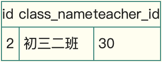
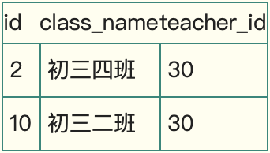
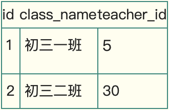

# Next-Key锁

Next-Key锁是行锁和GAP（间隙锁）的合并，行锁上文已经介绍了，接下来说下GAP间隙锁。

行锁可以防止不同事务版本的数据修改提交时造成数据冲突的情况。但如何避免别的事务插入数据就成了问题。我们可以看看RR级别和RC级别的对比

### RC级别：

<table>
  <thead>
    <tr>
      <th style="text-align:left">&#x4E8B;&#x52A1;A</th>
      <th style="text-align:left">&#x4E8B;&#x52A1;B</th>
    </tr>
  </thead>
  <tbody>
    <tr>
      <td style="text-align:left">begin;</td>
      <td style="text-align:left">begin;</td>
    </tr>
    <tr>
      <td style="text-align:left">
        
select id,class_name,teacher_id from class_teacher where teacher_id=30;

        

          
        

      </td>
      <td style="text-align:left"></td>
    </tr>
    <tr>
      <td style="text-align:left">update class_teacher set class_name=&apos;&#x521D;&#x4E09;&#x56DB;&#x73ED;&apos;
        where teacher_id=30;</td>
      <td style="text-align:left"></td>
    </tr>
    <tr>
      <td style="text-align:left"></td>
      <td style="text-align:left">
        
insert into class_teacher values (null,&apos;&#x521D;&#x4E09;&#x4E8C;&#x73ED;&apos;,30);

        
commit;

      </td>
    </tr>
    <tr>
      <td style="text-align:left">
        
select id,class_name,teacher_id from class_teacher where teacher_id=30;

        

          
        

      </td>
      <td style="text-align:left"></td>
    </tr>
  </tbody>
</table>### RR级别：

<table>
  <thead>
    <tr>
      <th style="text-align:left">&#x4E8B;&#x52A1;A</th>
      <th style="text-align:left">&#x4E8B;&#x52A1;B</th>
    </tr>
  </thead>
  <tbody>
    <tr>
      <td style="text-align:left">begin;</td>
      <td style="text-align:left">begin;</td>
    </tr>
    <tr>
      <td style="text-align:left">
        
select id,class_name,teacher_id from class_teacher where teacher_id=30;

        

          
        

      </td>
      <td style="text-align:left"></td>
    </tr>
    <tr>
      <td style="text-align:left">update class_teacher set class_name=&apos;&#x521D;&#x4E09;&#x56DB;&#x73ED;&apos;
        where teacher_id=30;</td>
      <td style="text-align:left"></td>
    </tr>
    <tr>
      <td style="text-align:left"></td>
      <td style="text-align:left">
        
insert into class_teacher values (null,&apos;&#x521D;&#x4E09;&#x4E8C;&#x73ED;&apos;,30);

        
waiting....

      </td>
    </tr>
    <tr>
      <td style="text-align:left">
        
select id,class_name,teacher_id from class_teacher where teacher_id=30;

        

          
        

      </td>
      <td style="text-align:left"></td>
    </tr>
    <tr>
      <td style="text-align:left">commit;</td>
      <td style="text-align:left">&#x4E8B;&#x52A1;Acommit&#x540E;&#xFF0C;&#x4E8B;&#x52A1;B&#x7684;insert&#x6267;&#x884C;&#x3002;</td>
    </tr>
  </tbody>
</table>通过对比我们可以发现，在RC级别中，事务A修改了所有teacher\_id=30的数据，但是当事务Binsert进新数据后，事务A发现莫名其妙多了一行teacher\_id=30的数据，而且没有被之前的update语句所修改，这就是“当前读”的幻读。

RR级别中，事务A在update后加锁，事务B无法插入新数据，这样事务A在update前后读的数据保持一致，避免了幻读。这个锁，就是Gap锁。

MySQL是这么实现的：

在class\_teacher这张表中，teacher\_id是个索引，那么它就会维护一套B+树的数据关系，为了简化，我们用链表结构来表达（实际上是个树形结构，但原理相同）

如图所示，InnoDB使用的是聚集索引，teacher\_id身为二级索引，就要维护一个索引字段和主键id的树状结构（这里用链表形式表现），并保持顺序排列。

Innodb将这段数据分成几个个区间

* \(negative infinity, 5\],
* \(5,30\],
* \(30,positive infinity\)；

update class\_teacher set class\_name=‘初三四班’ where teacher\_id=30;不仅用行锁，锁住了相应的数据行；同时也在两边的区间，（5,30\]和（30，positive infinity），都加入了gap锁。这样事务B就无法在这个两个区间insert进新数据。

受限于这种实现方式，Innodb很多时候会锁住不需要锁的区间。如下所示：

<table>
  <thead>
    <tr>
      <th style="text-align:left">&#x4E8B;&#x52A1;A</th>
      <th style="text-align:left">&#x4E8B;&#x52A1;B</th>
      <th style="text-align:left">&#x4E8B;&#x52A1;C</th>
    </tr>
  </thead>
  <tbody>
    <tr>
      <td style="text-align:left">begin;</td>
      <td style="text-align:left">begin;</td>
      <td style="text-align:left">begin;</td>
    </tr>
    <tr>
      <td style="text-align:left">
        
select id,class_name,teacher_id from class_teacher;

        

          
        

      </td>
      <td style="text-align:left"></td>
      <td style="text-align:left"></td>
    </tr>
    <tr>
      <td style="text-align:left">update class_teacher set class_name=&apos;&#x521D;&#x4E00;&#x4E00;&#x73ED;&apos;
        where teacher_id=20;</td>
      <td style="text-align:left"></td>
      <td style="text-align:left"></td>
    </tr>
    <tr>
      <td style="text-align:left"></td>
      <td style="text-align:left">
        
insert into class_teacher values (null,&apos;&#x521D;&#x4E09;&#x4E94;&#x73ED;&apos;,10);

        
waiting .....

      </td>
      <td style="text-align:left">insert into class_teacher values (null,&apos;&#x521D;&#x4E09;&#x4E94;&#x73ED;&apos;,40);</td>
    </tr>
    <tr>
      <td style="text-align:left">commit;</td>
      <td style="text-align:left">&#x4E8B;&#x52A1;A commit&#x4E4B;&#x540E;&#xFF0C;&#x8FD9;&#x6761;&#x8BED;&#x53E5;&#x624D;&#x63D2;&#x5165;&#x6210;&#x529F;</td>
      <td
      style="text-align:left">commit;</td>
    </tr>
    <tr>
      <td style="text-align:left"></td>
      <td style="text-align:left">commit;</td>
      <td style="text-align:left"></td>
    </tr>
  </tbody>
</table>update的teacher\_id=20是在\(5，30\]区间，即使没有修改任何数据，Innodb也会在这个区间加gap锁，而其它区间不会影响，事务C正常插入。

如果使用的是没有索引的字段，比如update class\_teacher set teacher\_id=7 where class\_name=‘初三八班（即使没有匹配到任何数据）’,那么会给全表加入gap锁。同时，它不能像上文中行锁一样经过MySQL Server过滤自动解除不满足条件的锁，因为没有索引，则这些字段也就没有排序，也就没有区间。除非该事务提交，否则其它事务无法插入任何数据。

行锁防止别的事务修改或删除，GAP锁防止别的事务新增，行锁和GAP锁结合形成的的Next-Key锁共同解决了RR级别在写数据时的幻读问题。

