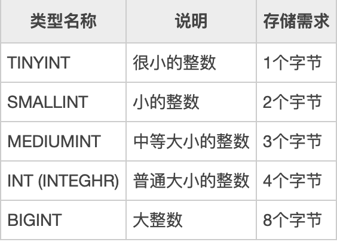

# 整数类型

MySQL主要提供的整数类型有 **TINYINT**、**SMALLINT**、**MEDIUMINT**、**INT**、**BIGINT**，其属性字段可以添加 AUTO\_INCREMENT 自增约束条件。

不同的整数类型有不同的取值范围，并且需要不同的存储空间，因此应根据实际需要选择最合适的类型，这样有利于提高查询的效率和节省存储空间。

## int\(20\)中20的涵义

是指显示字符的长度。20表示最大显示宽度为20，但仍占4字节存储，存储范围不变；

不影响内部存储，只是影响带 zerofill 定义的 int 时，前面补多少个 0，易于报表展示

